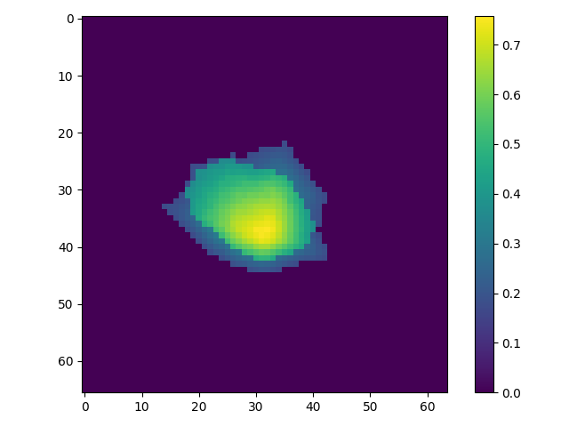

# RTI-game
Play a web-based game by moving your human body in a Real-time Tomographic Imaging (RTI) environment. 

## Live connection
Messages enter the program via a connection to an MQTT broker. By subscribing to a specific topic, the messages can be processed live.

## RTI environment
The environment consists of a matrix with 66 rows and 64 columns. In the real world, the environment is 320x330 cm, so each cell in the matrix is a 5x5 cm square.
We can visualize the movement of human bodies by plotting the values (between 0 and 1) of each cell in the matrix.

## Control keys
Using the PyAutoGUI package, we can simulate the clicking with a mouse or pressing keys on the keyboard.
